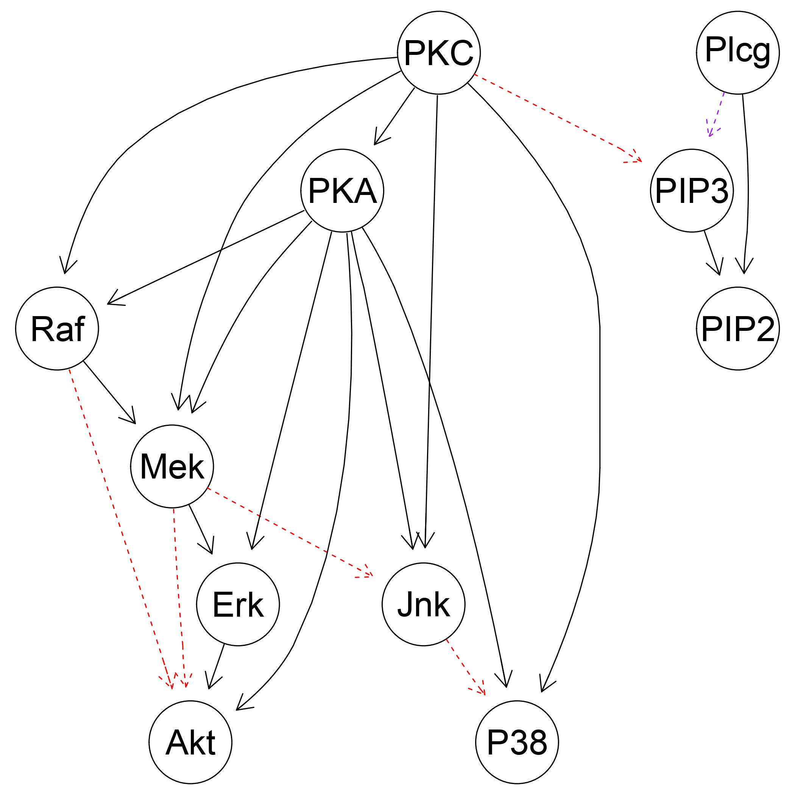
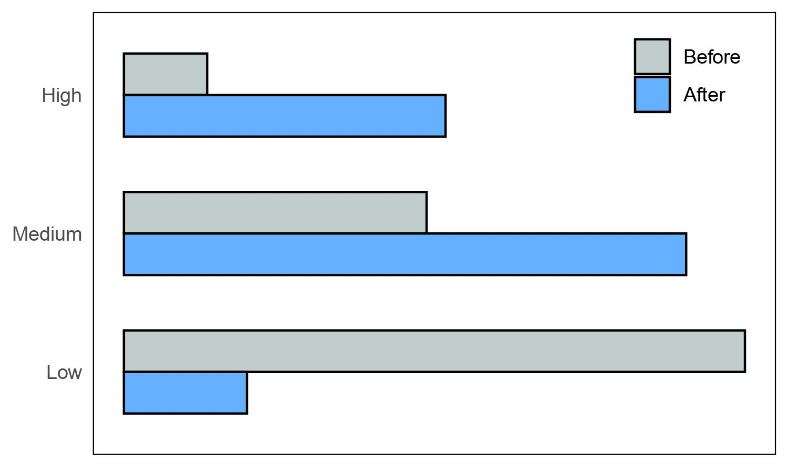
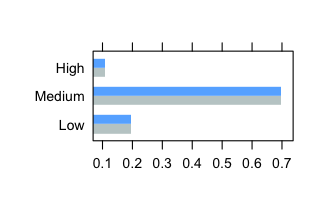

# Exploring Bayesian Networks: Replicating Causal Protein Signalling Study

This study replicates Sachs et al.’s (2005) “Causal Protein-Signaling Networks Derived from Multiparameter Single-Cell Data” using Bayesian networks (BN). We explore the fundamental concepts of BNs, emphasizing their role in causal inference. We successfully  reconstructed the 17 arcs reported in the original paper using the Tabu search algorithm with MBDe score. Five false positives were  identified in our analysis, indicating potential overinclusiveness of the model. We discuss the implications of these findings and  highlight the practical applications of BNs in unraveling causal relationships in complex biological systems. Additionally, we address the replication issues encountered during the project.

Find the full paper [here](https://github.com/GregoryTomy/Bayesian-Networks/blob/master/paper/paper.pdf).

## Final Network:

M5 successfully identified all the arcs from the target network. The three arcs missed by Sachs et al. (2005) were also missed by M5. There were no false negatives, however, the model did return 5 false positives. Further increase in the significance resulted in the breakdown of the network structure.

## Inference:

Bayesian networks can be queried to make probabilistic predictions about the network variables. The model should correctly infer causal influences for molecules that were not directly intervened with. Sachs et al. (2005) investigate two such queries in their study. The model presented the arc $Erk → Akt$ despite $Erk$ not being directly perturbed. As a result, changing $Erk$ should have an effect on $Akt$. 

Similarly, despite being correlated, the model did not present an ark from $Erk$ to $PKA$. Perturbing the former should have no effect on the latter. Sachs et al. (2005) verified these predictions experimentally. In this project, the model was queried by instantiating $Erk$ to high. As expected, instantiating $Erk$ did effect the probability distribution of $Akt$, but did not effect $PKA$.

