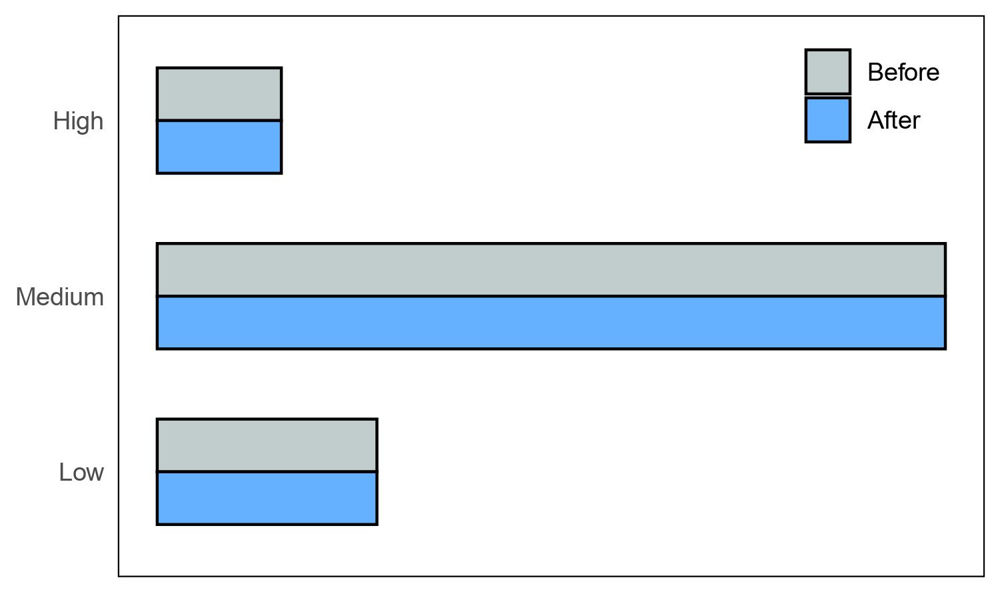

# Bayesian Networks: Replicating Causal Protein Signalling Study

This study replicates Sachs et al.’s (2005) “Causal Protein-Signaling Networks Derived from Multiparameter Single-Cell Data” using Bayesian networks (BN). We explore the fundamental concepts of BNs, emphasizing their role in causal inference. **We successfully  reconstructed the 17 arcs reported in the original paper using the Tabu search algorithm with MBDe score**. Five false positives were  identified in our analysis, indicating potential overinclusiveness of the model. We discuss the implications of these findings and  highlight the practical applications of BNs in unraveling causal relationships in complex biological systems. Additionally, we address the replication issues encountered during the project.

## Links
1. Find the full paper [here](https://github.com/GregoryTomy/Bayesian-Networks/blob/master/paper/paper.pdf).
2. Find the accompanying presentation [here](https://youtu.be/AYW6eY8ohDo).

## Overview

Bayesian Networks provide a useful tool for the analysis of biological data due to their capacity to model complex relationships among variables, identify causal relationships, and make predictions. In biological research, BNs have been applied to a diverse range of problems, from elucidating genetic interactions to modeling cellular signaling pathways. The latter is explored in this paper. 

Signaling pathways are complex networks of proteins that transmit signals within cells, and their disregulation can lead to many diseases, including cancer. BNs have been used to model these pathways and identify key proteins and interactions critical for the pathway’s function (Mukherjee and Speed 2008; Ciaccio et al. 2010). Signaling pathways data is ideal for BNs due to its highdimensional and complex nature, making it difficult to interpret using traditional statistical approach. BNs can
model nonlinear and dynamic relationships among variables and can also handle incomplete or noisy data, making them robust in the face of data quality issues that are commonly encountered in biological research. Furthermore, BNs allow for the integration of prior knowledge into the analysis, such as known interactions among proteins, which can improve accuracy and interpretability of the results.

An excellent illustration of utilizing protein-signaling data is presented in Sachs et al. (2005). BNs were used to automate derivation of causal influences in cellular signaling networks. The authors simultaneously measured multiple phosphorylated molecules in thousands of human single cells. The molecules were treated with generic and specific molecular interventions. The former was used to generate the network skeleton, whilst the latter was used to interpret causal influence relationships.

## Data
Two data sets were used in the project. The first observation-only dataset was obtained from Sachs et al. (2005) supplementary materials. The observational data
served as the basis for exploratory and preliminary analysis. There were 852 observations for the 11 phosphorylated molecules. The second data set was obtained through
Scutari and Denis (2021)’s analysis. It contained 5400 data points which included the observation-only data in addition to stimulatory and inhibitory intervention data. A 12th column, INT, recorded the intervened molecules.

## Final Network:

M5 successfully identified all the arcs from the target network. The three arcs missed by Sachs et al. (2005) were also missed by M5. There were no false negatives, however, the model did return 5 false positives. Further increase in the significance resulted in the breakdown of the network structure.

## Inference:

Bayesian networks can be queried to make probabilistic predictions about the network variables. The model should correctly infer causal influences for molecules that were not directly intervened with. Sachs et al. (2005) investigate two such queries in their study. The model presented the arc $Erk → Akt$ despite $Erk$ not being directly perturbed. As a result, changing $Erk$ should have an effect on $Akt$. 

Similarly, despite being correlated, the model did not present an ark from $Erk$ to $PKA$. Perturbing the former should have no effect on the latter. Sachs et al. (2005) verified these predictions experimentally. In this project, the model was queried by instantiating $Erk$ to high. As expected, instantiating $Erk$ did effect the probability distribution of $Akt$, but did not effect $PKA$.

